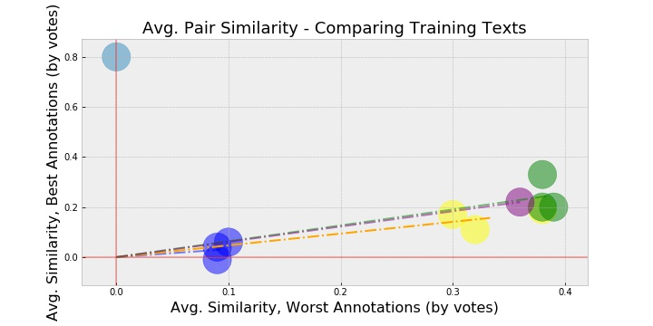
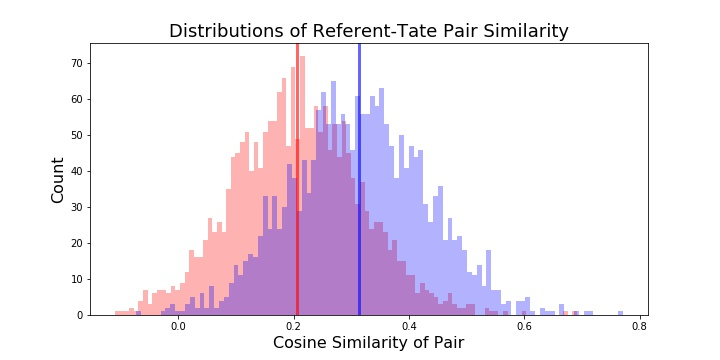

# Annotations and Lyrics: Are they *"Genius?"*

### Using Doc2Vec to Automate Evaluation of User-Generated Lyric Annotations on Genius.com

Capstone II Project for Galvanize Data Science Immersive

by Taite Sandefer

## Table of Contents
- [Introduction](#introduction)
- [Strategy and Process](#strategy-and-process)
- [Overview of the Data](#overview-of-the-data)
    + [Descriptions of features](#descriptions-of-the-13-unique-numerical-attributes-for-each-song)
- [Exploratory Data Analysis](#exploratory-data-analysis)
  * [EDA Takeaways](#eda-takeaways)
- [First Model: Linear Regression](#first-model--linear-regression)
- [Undersampling](#undersampling)
- [Second Model: Logistic Regression](#second-model--logistic-regression)
  * [Selected songs from model predictions](#selected-songs-from-model-predictions)
  * [Final Coefficients and Interpretation](#final-coefficients-and-interpretation)
- [Reflection and Future Work](#reflection-and-future-work)
  * [Reflection](#reflection)
  * [Future Work](#future-work)
  

  

# Introduction: What is Genius?
[Genius](https://genius.com/), formerly "Rap Genius," is a website where users can view and add annotations to lyrics that help explain their meaning and context. 

### Problem: Crowdwork
Today, the Genius system still relies heavily on crowdsourced human work. When an annotation gets posted, it must be read and "accepted" by a higher-ranking user in the community for it to stick on the public lyrics page. 

If the moderators are busy, or uninterested, good annotations can go unreviewed and unposted. Additionally, a grumpy moderator might let poor annotations slip through, or choose to trash good annotations. If moderators do take the time to read through annotations, it's likely to take up a lot of their time.

* Human error
    * Accepting "bad" annotations (FP)
    * Rejecting "good" annotations (FN)
* Time 

### A Potential Solution
Thanks to some exciting innovations in NLP over the past few years, it might be possible to create an evaluation system that is able to automatically accept/reject user-submitted annotations.

In order to create a system like this, we must consider: **What makes a "good" Genius annotation?**

The main goal of Genius is to explain lyrics and help make them more accessible to listeners. Generally, these are explanations regarding the semantic and/or cultural meanings behind lyrics, which are often be cryptic and filled with linguistic subtleties, like Frank Ocean's double-entendre:

However, annotations can be anything that helps add to the experience of the music, which isn't limited to this sort of explanation. For example, verified artists can annotate their own lyrics, and often discuss how they were feeling the day they wrote the lines, rather than explaining the meaning behind them. 

Eminem does this a lot, actually. For example...

Since we're looking at annotations of lyrics, let's look at this like a translation problem. In a sense, users are looking at artful/poetic language, and "translating" it into prose. They're *explaining* it.

## How might NLP help?
### Doc2Vec to the rescue! 
Doc2Vec is a neural network model that strives to learn how to best encode words, and documents, into vectors that represent their contextual orientation. The idea is that as you read lines of text, a latent "context window" traverses through the text as well that captures the combined different meanings of the present words. 
D2V models assume a default 5-token window, meaning that the context window extends to the two words on either side of the target word. 

Doc2Vec is likely better suited to this lyric-annotation problem than other text-encoding methods, like the Tf-idf and BoW approach, which represent language based on a more simplified perspective of frequency. 

As an extension of Word2Vec, which was originally published in 2013, Doc2Vec has two architectural flavors. 

* Distributed Bag of Words
    * Pr(word | surrounding words)
* Distributed Memory
    * Pr(surrounding words | word)
    * Generally has been found to perform better, particularly with semantic tasks
 

  
  
## Learning a word from its context
*"Tell me who your friends are, and I'll tell you who you are"*

*“The meaning of a word can be inferred by the company it keeps”*

"If you have two words that have very similar neighbors (meaning: the context in which its used is about the same), then these words are probably quite similar in meaning or are at least related. For example, the words shocked, appalled and astonished are usually used in a similar context."

### Example:
"love" and "like" probably don't occur directly next to each other. Since they have similar meaning, they might not even occur nearby each other at all (to avoid repetition).

Pure count/frequency/co-occurence based representations (ex: BOW, tf-idf):
  vector representations would be dissimilar, because have relatively low co-occurrence
Context-window/"neighbors" based representations (ex: w2v, d2v, s2s):
  vector representations would be similar, because the words they do tend to co-occur with are similar/common

- Context = Latent ("hidden")
  - represented by hidden layer
  - soft clustering

## Necessary Assumptions
* Distributional Hypothesis: words that frequently occur near each other will have similar semantic meanings

* "Good" annotations are contextually similar to the lyric they describe. Compared to the lyrics they describe, annotations are more verbose and use plain language (as opposed to prose) and are more explicitly clear. 

* The vocabulary used by annotations will generally not be the same as the vocabulary used in the annotation itself, except with specific rare/slang words that are the object of discussion. When they are similar, this isn't as much about the quality of the annotation -- most annotations can, and do, repeat some of the exact verbage of the lyrics. What matters is that the words utilized that aren't identical in literal vocabulary ARE similar in their semantic/contextual meaning. AKA, they tend to have "similar neighbors" as each other.

[Back to Top](#Table-of-Contents)

# Overview of the Data
This data came from the Genius API and has been stored in both MongoDB and .csv files using BeautifulSoup, requests, and johnwmillr's [LyricsGenius](https://github.com/johnwmillr/LyricsGenius). This information came from scraping all annotations from the top 50 songs from the 20 most active artists on Genius. 

I pulled the text and other characteristic features for annotations and their corresponding lyric segments.   
Although I had planned to get about 17,000 observations, I ended up with 3,573 lyric-annotation pairs. 

### Top 20 Artists on Genius
- Drake
- Eminem
- Kendrick Lamar
- Kanye West
- The Weeknd
- J. Cole
- XXXTENTACION
- Lil Wayne
- Original Broadway Cast of Hamilton
- JAY-Z
- Ariana Grande
- Beyoncé

| | Artist | Number of Songs | Number of Annotations |
|--- | --- | --- | --- |
|1| Drake | 33 | 314 |
|2| Eminem | 43 | 426 |
|3|Kendrick Lamar | 35 | 350 |
|4| Kanye West | 35 | 341 |
|5| The Weeknd | 34 | 286 |
|6| J. Cole | 46 | 438 |
|7| XXXTENTACION | 38 | 254 |
|8| Lil Wayne | 14 | 139 |
|9| Original Broadway Cast of Hamilton | 46 | 457 |
|10| JAY-Z | 18 | 180 |
|11| Ariana Grande | 41 | 273 |
|12| Beyoncé | 12 | 115 |

### Engineered Features
- votes per 100k viewers
- character count for text
- word count for text
- Cosine Similarity of annotation-lyric pair

[Back to Top](#Table-of-Contents)

# Exploratory Data Analysis

## EDA Takeaways

[Back to Top](#Table-of-Contents)

# Model Selection
## How should I train my model?
With 2 distinct different types of text, which I'm trying to represent in the same context window space, what should my model be trained on?

### "size" parameter decision

- "size": the size of the resulting w2v or d2v vectors, = the number of neurons in the hidden layer
- more neurons --> NN has higher capacity to represent context/meaning (lots of dimensions!)
  - BUT more neurons also means your NN needs more data in order to train them
      - Therefore, it's better to keep "size" small in the absence of sufficient data
  - "size" = 100-300 normally
  
## Chosen Model Specs

* vector_size = 100 (number of hidden nodes in Neural Net)
    - More neurons --> higher complexity, better able to capture something as complex as "context"
    - More neurons --> higher need for additional data (we don't have that much!)
* 

# So... Now that we have a model... Is there a difference?!

Using the preferred model specifications described above:

## Hypothesis Testing
Using the cosine similarities calculated across annotation-lyric pairs for each of the groups, hypothesis testing yielded favorable reults! 

* H0: The mean of the Cosine Similarity for non-pairs is equal to the mean of the cosine similarity for pairs 
* t-Statistic: 29.326956044074937
* p-value: 1.1563935728521e-171 

This p-value is very close to zero, and we can reject the null at the 99% confidence level, given the observed data and other assumptions holding true. 

Thus, the evidence suggests that using a Doc2Vec model to infer vector representations of annotations and lyrics could be effective in determining whether or not annotations are relevant to the lyrics they're describing. 

[Back to Top](#Table-of-Contents)

# Reflection and Future Work
## Reflection
- 

## Future Work

-

[Back to Top](#Table-of-Contents)
