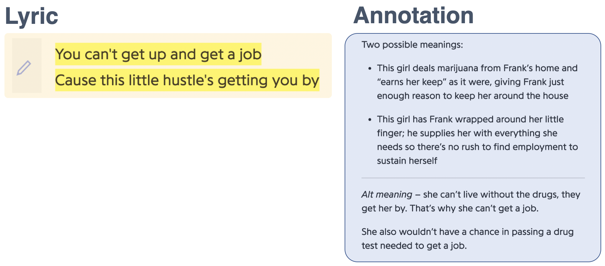
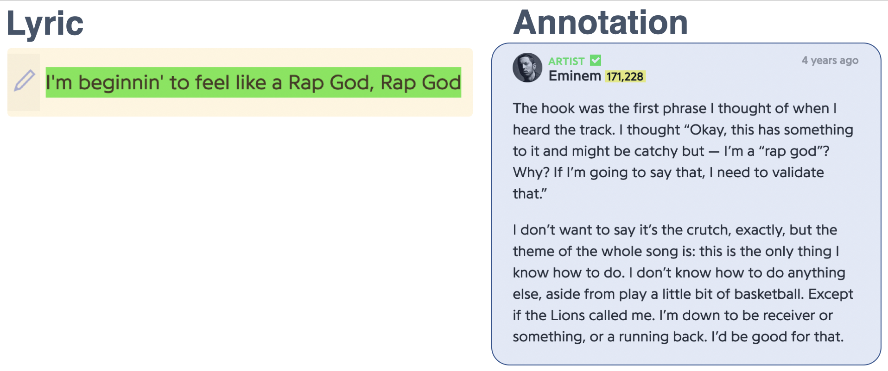
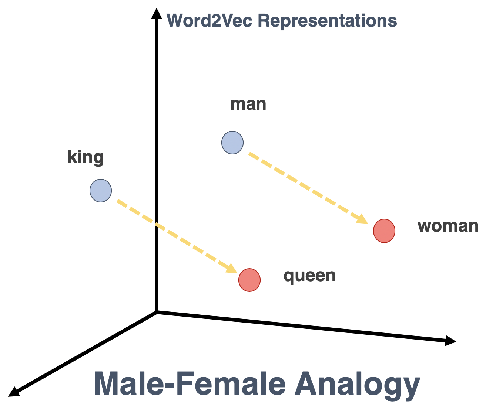
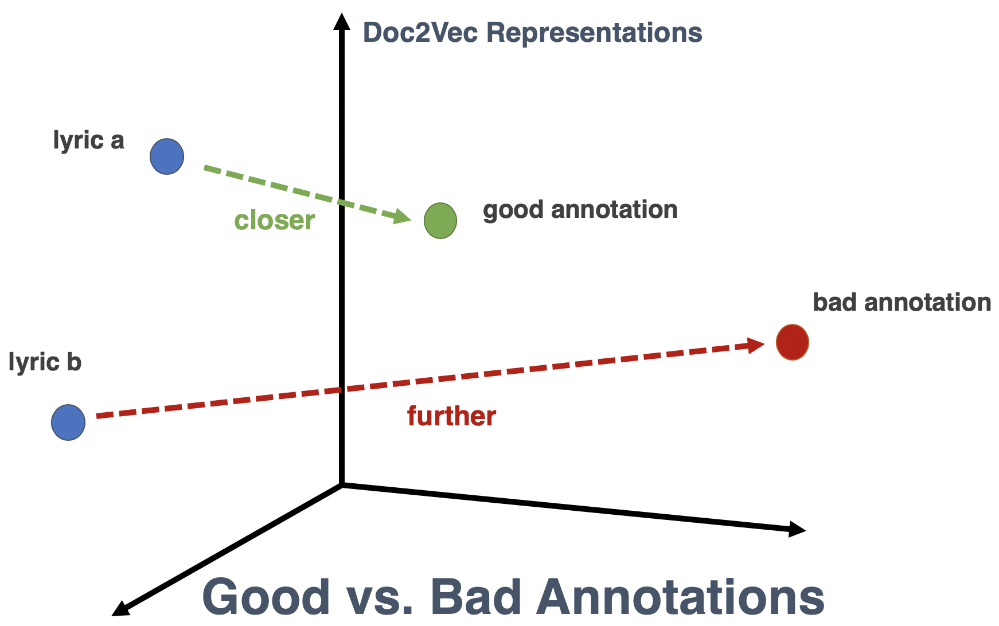
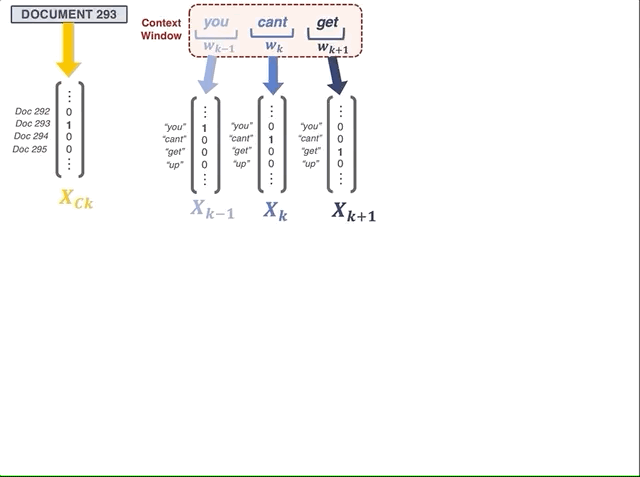
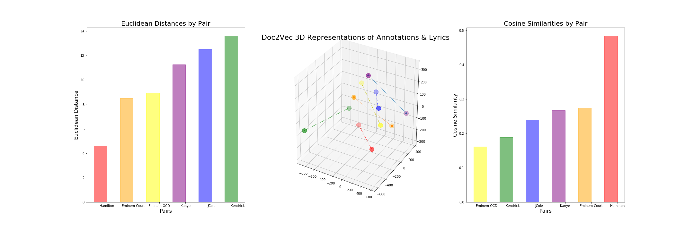

# Doc2Vec and Annotated Lyrics: Are they *"Genius?"*

### Using Gensim's Doc2Vec to Evaluate Crowdsourced Lyric Annotations on Genius.com

*by Taite Sandefer* | *Capstone II Project for Galvanize Data Science Immersive, Week 8* | *Last Updated: 4/7/19*

## Table of Contents
- [Introduction](#introduction)
  - [Background](#background)
  - [Hypothesis and Assumptions](#hypothesis-and-assumptions)
  - [Methodology](#methodology) 
- [Data Overview](#data-overview)
  - [Exploratory Data Analysis](#exploratory-data-analysis)
  - [Engineered Features](#engineered-features)
  - [Challenges](#challenges)
- [Model Selection](#model-selection)
  - [Text Preprocessing](#text-preprocessing)
  - [Model Architecture](#model-architecture)
  - [Training Corpus](#training-corpus)
  - [Hyperparameter Tuning](#hyperparameter-tuning)
  - [Performance Metrics](#performance-metrics)
- [Chosen Model](#chosen-model)
  - [Specifications](#specifications)
  - [Model Assessment](#model-assessment)
  - [Results and Interpretation](#results-and-interpretation)
- [Discussion](#discussion)
- [Acknowledgements](#acknowledgements)
  - [Citations](#citations)


# Introduction
## Background
### What is Genius?
[Genius](https://genius.com/), formerly "Rap Genius," is a website where users can view and add annotations to lyrics that help explain their meaning and context.

<p align="center">
  
</p>

The primary goal of Genius is to explain lyrics and help make them more accessible to listeners. Generally, these are explanations regarding the semantic and/or cultural meanings behind lyrics, which can often cryptic and filled with linguistic subtleties that we wouldn't normally expect a computer to be able to pick up on. 

<p>
    
  
  
</p>

### Problem
Today, the Genius system still relies heavily on crowdsourced human work. When an annotation gets posted, it must be read and "accepted" by a higher-ranking user in the community for it to stick on the public lyrics page.

**Costs Associated with Human Evaluation**
* Time
* Human error
  * Accepting "bad" annotations (FP)
  * Rejecting "good" annotations (FN)

If the moderators are busy, or uninterested, good annotations can go unreviewed and unposted. Additionally, a grumpy moderator might let poor annotations slip through, or choose to trash good annotations. If moderators do take the time to read through annotations, it's likely to take up a lot of their time. If it were possible to reliably automate this process, it could both save time and increase the accuracy of evaluation.

So, what makes a good Genius annotation? According to Genius, 

<p align="center">
  
</p>

For example, this is a good explanation of the double meaning behind this line from [Frank Ocean's *Pilot Jones*](https://genius.com/895793):

<p align="center">
  
</p>

However, annotations can be anything that helps add to the experience of the music, which isn't limited to this sort of explanation. For example, verified artists can annotate their own lyrics, and often discuss how they were feeling the day they wrote the lines, rather than explaining the meaning behind them.

Eminem does this a lot, actually. Here's an example of this from [Eminem's *Rap God*](https://genius.com/2566991):

<p align="center">
  
</p>

### A Potential Solution: Learning a Word from its Context
Doc2Vec is a neural network model that strives to learn how to best encode words, and documents, into vectors that represent their contextual orientation, based on the data it was exposed to in training.

> "Tell me who your friends are, and I'll tell you who you are"

The idea is that as you read lines of text, a latent "context window" traverses through the text and captures the aggregate meaning of the words within, while continues to shift and evolve as it moves along the text.

<p align="center">
  
</p>

Doc2Vec is designed to pick up on these subtle linguistic patterns, which is why it's likely better suited to this lyric-annotation problem than other text-encoding methods, like BoW/Tf-idf. Instead of using a frequentistic measure of occurrence or co-occurence, Doc2Vec attempts to measure association between words with a combination of both through pointwise mutual information.

> “The meaning of a word can be inferred by the company it keeps"

<p align="center">
  
  <br></br>
  
  <br></br>
  
</p>

Thanks to this exciting innovation in NLP, it might be possible to create an evaluation system that automatically accepts/rejects user-submitted annotations based on the similarity of their Doc2Vec representations. 

### Properties of Word/Doc2Vec

Interestingly, Word2Vec vectors have been found to have arithmetic properties that resemble the functionality of word analogies when properly trained. For example, if you subtract the word vector for queen from the vector for king, you get approximately the same result as when you subtract the vector for woman from the vector for man, which roughly gives us the vector representation of male-female meaning in context. 

<p align="center">
  
  <br></br>
  
</p>

Will this work similarly for Doc2Vec vectors when the semantic or contextual meanings between two documents are similar? 


## Hypothesis and Assumptions
### Hypothesis
The idea behind this project is that the DocVec representations of lyric segments and their corresponding annotations will be inherently more similar if they are good annotations, whereas those of bad annotations will not be similar. If this is true, then we can systematically use this metric to infer the DocVec representations of unseen annotations to determine whether they should be "accepted" or not. 

If the assumptions hold true, an appropriately-trained Doc2Vec model will be able to infer vector representations of unseen lyrics and annotations that are more similar for good annotations than for bad annotations. 

<p align="center">
  
</p>

### Assumptions
* Distributional Hypothesis: *"Words that frequently occur near each other will have similar semantic meanings"*

* "Good" annotations are contextually similar to the lyric they describe. They attempt to explain the semantic meaning behind their respective lyrics, acting approximately as a prose translation of the lyrics. 

* Compared to the lyrics they describe, annotations are more verbose and use natural language and are more explicitly clear.

* The vocabulary used by annotations will generally not be the same as the vocabulary used in the annotation itself, except with specific rare/slang words that are the object of discussion. When they are similar, this isn't as much about the quality of the annotation -- most annotations can, and do, repeat some of the exact verbage of the lyrics. What matters is that the words utilized that aren't identical in literal vocabulary ARE similar in their semantic/contextual meaning. AKA, they tend to have "similar neighbors" as each other.

## Methodology
- Obtain data from API
- Preprocess text
- Train Doc2Vec model on preprocessed text data
- Obtain inferred Doc2Vec representations of lyric-annotation pairs
- Calculate similarity metric of pairs
- Convert select DocVec representation to 3-dimensions using t-SNE
- Represent t-SNE representations graphically

[Back to Top](#Table-of-Contents)


# Data Overview
This data came from the Genius API and has been stored in both MongoDB and .csv files using requests and johnwmillr's [LyricsGenius](https://github.com/johnwmillr/LyricsGenius). This information came from scraping all annotations from the top 50 songs from the 20 most active artists on Genius.

I pulled the text and other characteristic features for annotations and their corresponding lyric segments. Although I had originally planned to get about 17,000 observations, I ended up working with 3,573 lyric-annotation pairs.

## Exploratory Data Analysis

### Top 12 Artists on Genius

| | Artist | Songs in Corpus | Total Annotations |
|--- | --- | --- | --- |
|1| Drake | 33 | 314 |
|2| Eminem | 43 | 426 |
|3|Kendrick Lamar | 35 | 350 |
|4| Kanye West | 35 | 341 |
|5| The Weeknd | 34 | 286 |
|6| J. Cole | 46 | 438 |
|7| XXXTENTACION | 38 | 254 |
|8| Lil Wayne | 14 | 139 |
|9| Original Broadway Cast of Hamilton | 46 | 457 |
|10| JAY-Z | 18 | 180 |
|11| Ariana Grande | 41 | 273 |
|12| Beyoncé | 12 | 115 |

## Engineered Features
- Votes per 100k viewers
- Character count for text
- Word count for text
- Cosine Similarity of annotation-lyric pairs

## Challenges

Unfortunately, the Genius API does not provide access to data on "rejected" annotations. Thus, we need to use other features to help us distinguish between "good" and "bad" annotations.

It looks like "Votes" might not be a great metric for determinng whether an annotation is good or not! However, there are many studies in the past that have had promising experiences using Doc2Vec to predict whether a piece of text is similar to another piece of text. Researchers have often created datasets to do this by mixing up pairings between sentences and paragraphs, which they do or don't belong to, and compared the similarity of vectors from true matches and false matches.

For testing, I decided to randomly assign lyric-annotation pairs that were tied to music from different artists. Then, I wanted to examine whether there was a statistically significant difference between the true pairs and the mismatched pairs of lyrics and annotations. If the DocVecs were able to pick up on the relevant context patterns, I'd expect "good"/"true" pairs to be more similar than their "bad"/"mismatched" partners.

<p align="center">
  
  
</p>


[Back to Top](#Table-of-Contents)


# Model Selection
## Text Preprocessing 
While other NLP techniques call for various transformations in the text data Pipeline, Doc2Vec typically performs better when the variation in the text is preserved. Therefore, text was lowercased and verse tags were removed from the data, but otherwise most of the text was kept as is. Apostrophes were removed from contraction words so that they would be treated as one word, and all other punctuation was treated as its own token as well. 

<p align="center">
  
</p>

## Model Architecture 
As an extension of Word2Vec, which was originally published in 2013, Doc2Vec has two architectural flavors.

* Distributed Bag of Words
    * Pr(word | surrounding words)
* Distributed Memory
    * Pr(surrounding words | word)
    * Generally has been found to perform better, particularly with semantic tasks

<p align="center">
  
</p>

## Training Corpus
### Transfer Learning
Since there are only 3,500 data points, making the model vulnerable to overfitting, it'd be wise to consider using pretrained word vectors that have already been exposed to millions, or more, words. 

However, I was unable to find any pretrained models that were exposed to text comparable to these lyric and annotation pairs. The majority of pretrained word vectors have been trained on Wikipedia articles or similar text, which is fairly academic and less prone to poetic or naturalistic tendencies than these lyrics and annotations. 

I made the decision to use models trained only on this Genius annotation/lyric data because it would be misleading to use a model trained primarily on text that is so inherently different from the target data. 

### Categories of Texts
With two distinct categories of text that need to be encoded in comparable context window dimensions, which should my model be trained on?

Trained 4 different training corpus variations for comparison:
  * Lyrics only
  * Annotations only
  * Lyrics & Annotations
  * Lyrics & Annotations (with distinguishing annotation/lyric tag)

## Hyperparameter Tuning
| Hyperparameter | Description | Default Value |
|--- | --- | --- |
| window | number of words in context window | 5 |  
| vector_size | number of nodes in hidden layer | 100 |  
| epochs | number of iterations through the data | 100 |  
|  |  |  |  

## Performance Metrics
- Self-Recognition
  * Infer DocVectors for each training data point
  * Find the most similar DocVector, based on training
  * What percentage of the training dataset can the model accurately predict as its own best contextual match?
  * Standard: 95% and above
  * Each of my models were achieving self-recognition for around 97-99.4% of the training data
   * Except for the model that I trained on tagged annotations and lyrics, which achieved roughly 17%

- Comparison against best/worst pairs 

<p align="center">
  
  <br></br>
  
</p>

[Back to Top](#Table-of-Contents)

# Chosen Model
## Specifications

* Gensim's Doc2Vec Model
* Distributed Memory architecture 
* trained only on untagged lyric & annotations
* Corpus was lowercased, included punctuation, and not stemmed or lemmatized when tokenized
* vector_size = 100 (# of neurons in hidden layer)
* window = 5
* 100 epochs

## Model Assessment 

### Hypothesis Test between True and Mismatched Pairs
<p align="center">
  
  <br></br>
  
</p>

Using the cosine similarities calculated across annotation-lyric pairs for "true" and "mistmatched" groups, hypothesis testing yielded interesting results!

```H0: The mean of the Cosine Similarity for false-match pairs is equal to the mean of the Cosine Similarity for true-match pairs```

|Statistic | Result |
|--- | --- |
|t-Stat| 29.32|
|p-val| 1.1e-171 |

This p-value is very close to zero, allowing us to reject the null hypothesis at the 99% confidence level, given the observed data and that other assumptions hold true.

Therefore, this evidence suggests that using a Doc2Vec model to infer vector representations of annotations and lyrics could be effective in determining whether or not annotations are relevant to the lyrics they're describing. 

It's important to note that this particular hypothesis test is done to determine whether the means of the cosine similarities for the true-match and the false-match pairs are statistically different from each other, when doc2vec DocVectors are obtained from a model trained on the preferred specifications (outlined above). This shows that it is possible obtain the results we hoped to find, using Doc2Vec, but it doesn't necessarily prove that they are reliable or that it is truly measuring the difference in meaning across these lyric-annotation pairs. It merely shows that there is more work to be done! 

## Results and Interpretation 
### Visualization: Reducing Dimensionality with t-SNE 

Interestingly, we can visualize this the way we want using t-SNE, which is a form of dimensionality reduction. t-SNE works best when we're reducing from 50 or fewer dimensions, so here we're using inferred vectors of size 50 and reducing them to only 3 dimensions so we can visualize their location relative to each other.

Keep in mind that this is fairly subjective: I selected 3 examples each of what I'd consider good and bad annotations. 

The "good" annotations are represented by the darker colors: green, blue, and purple.
The "bad" annotations are represented by the lighter colors: red, orange, and yellow. 

This isn't exactly what I expected to see. It might even be the exact opposite. In particular, the "bad" lyric represented in red seems to really subvert my expectation. However, when I re-examined the content of its lyric and annotation, I noticed that the lyric was only one word long. Perhaps this is causing an issue with Doc2Vec because there basically is no context window that can be moved around this single word? Though I've done some searching, I haven't been able to figure out exactly how Doc2Vec treats single-word (or even smaller-than-the-context-window) documents. It seems like that might be part of the issue here, though! 

<p align="center">
  
</p>

It also seems that this might not be the most accurate way to visualize the similarity between DocVecs. In the future, I hope to perform some PCA on higher-dimensional DocVecs (likely around 100, or more) and then apply t-SNE, which would likely do a better job at capturing the complex context signals. Of course, more data would likely do wonders to improve results as well. 

[Back to Top](#Table-of-Contents)

# Discussion

Although we did find a Doc2Vec model that produced interesting results in two-tailed hypothesis testing, it's important to note that the difference between these distributions was not strong enough to distinguish "true" and "false" pairs on its own. This shows us that this metric may be helpful, but it's not enough on its own to determine whether we should accept an annotation. We might be able to increase the complexity of these representations, which could help make their representations more distinct from each other, by increasing the number of nodes in the hidden layer of the Doc2Vec network, but this would require a lot more data and leave the model more vulnerable to overfitting. 

Until then, it'd be necessary to include other metrics in our final model to help distinguish between good and bad annotation groups. 

While I did find a model that produced interesting results, more data is necessary to produce reliable results. Most research published recommends having a dataset in the millions, not few thousand, so that the model will not be subject to overfitting.

It also seems like my assumption about the nature of Genius annotations does not hold as well as I expected. Many of the annotations I observed during this project were "off topic", at least in my opinion, and tended to link lyrics to indirect outside cultural events, rather than focusing on explaining their meaning. 

## Future Work
We may have found evidence supporting the claim that Doc2Vec can help distinguish between "good" and "bad" annotation pairs, but more research is needed with more data. The investigation of this project has revealed that this dataset might not satisfy the necessary assumptions, but that we still have something to learn from lyric-annotation Doc2Vecs that could be useful in creating an automatic evaluation system for annotations. 

[Back to Top](#Table-of-Contents)

# Acknowledgements
- [Genius.com](https://genius.com/)
- DSI instructors: Frank Burkholder, Danny Lumian, Kayla Thomas
- Cohort Peers working with NLP: Matt Devor, Aidan Jared, Lei Shan
- johnwmillr's [LyricsGenius](https://github.com/johnwmillr/LyricsGenius)
- [Gensim's Doc2Vec model](https://radimrehurek.com/gensim/models/doc2vec.html)
- [Robert Meyer's Presentation from PyData's 2017 Berlin Conference](https://www.youtube.com/watch?v=zFScws0mb7M)
- [Andy Jones' blog on the mechanics of Word2Vec](https://andyljones.tumblr.com/post/111299309808/why-word2vec-works)

## Citations
### Word2Vec Paper
[Mikolov, T., Sutskever, I., Chen, K., Corrado, G. S., & Dean, J. (2013). Distributed representations of words and phrases and their compositionality. In Advances in neural information processing systems (pp. 3111-3119).](https://papers.nips.cc/paper/5021-distributed-representations-of-words-and-phrases-and-their-compositionality.pdf)

### Random Walks on Context Spaces Paper
[Arora, S., Li, Y., Liang, Y., Ma, T., & Risteski, A. (2015). Rand-walk: A latent variable model approach to word embeddings. arXiv preprint arXiv:1502.03520.](https://arxiv.org/abs/1502.03520)

### Doc2Vec Papers
[Le, Q., & Mikolov, T. (2014, January). Distributed representations of sentences and documents. In International conference on machine learning (pp. 1188-1196).](https://arxiv.org/abs/1405.4053)

[Lau, J. H., & Baldwin, T. (2016). An empirical evaluation of doc2vec with practical insights into document embedding generation. arXiv preprint arXiv:1607.05368.](https://arxiv.org/abs/1607.05368)


[Back to Top](#Table-of-Contents)
